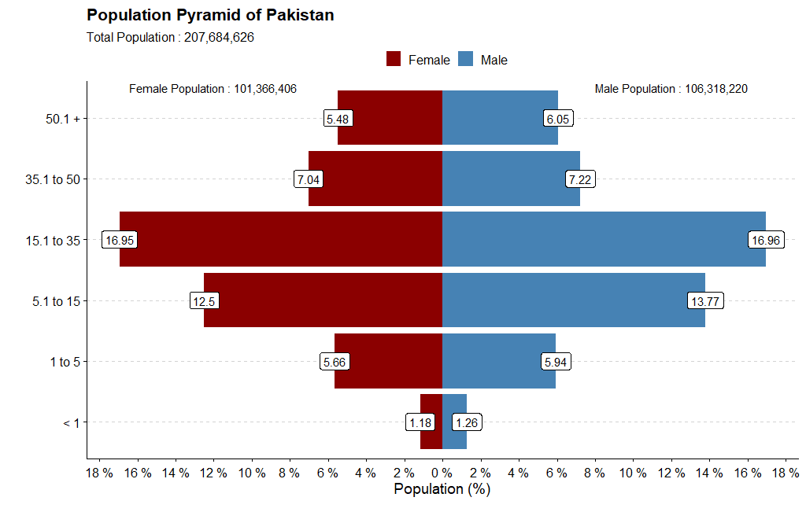

---
output:
  html_document: default
  pdf_document: default
theme: united
---

```{r setup, include=FALSE}
knitr::opts_chunk$set(echo = TRUE)
```

 
```{r know, echo = FALSE, out.width = "40%", fig.align='center'}
knitr::include_graphics("Did-You-Know.jpg")
```

<font size="5" face = "arial" color = "black">

- Male percentage of total population is 51.19 % while female are 48.81 % of Pakistan's total population.
- For every 100 people in Pakistan, 64 live in Rural Areas of Pakistan. 

</font>

```{r loading file, echo = FALSE, out.width = "150%", fig.align='center'}

```
<font size = "2">
Data Source : [*Pakistan Census Data 2017*](https://www.pbs.gov.pk/content/final-results-census-2017) 
</font>

<div style="text-align: right;"></div>