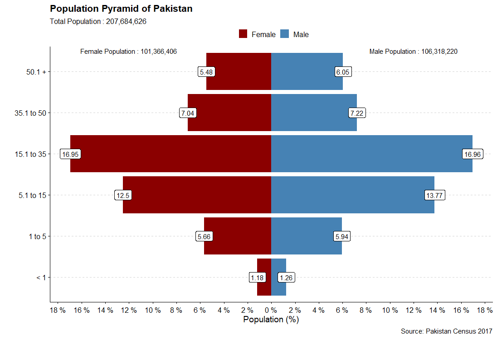

```{r setup, include=FALSE}
knitr::opts_chunk$set(echo = TRUE)
```
 
<font size = "8"  face="arial" color="#008000">
Did you know? 
</font>

<font size="6">

- Male percentage of total population is 51.19 % while female are 48.81 % of Pakistan's total population.
- The working age population in Pakistan is 56.66 %.
- For every 100 people in Pakistan, 64 live in Rural Areas of Pakistan. 

</font>

```{r loading file, echo = FALSE, out.width = "150%", fig.align='center'}

```
<font size = "6">
Data Source : [*Pakistan Census Data 2017*](https://www.pbs.gov.pk/content/final-results-census-2017) 
</font>
